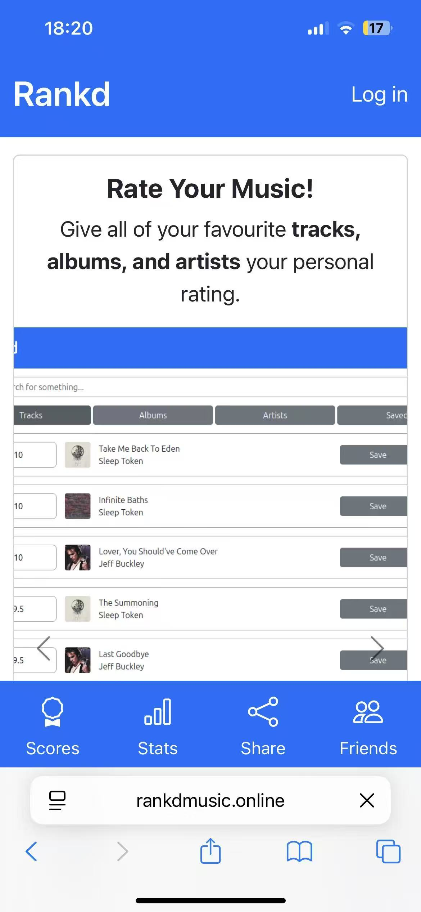
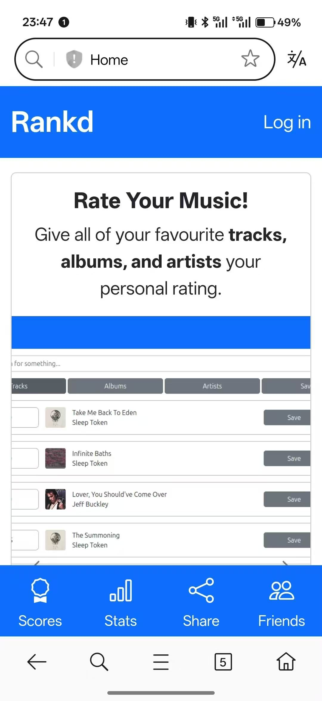
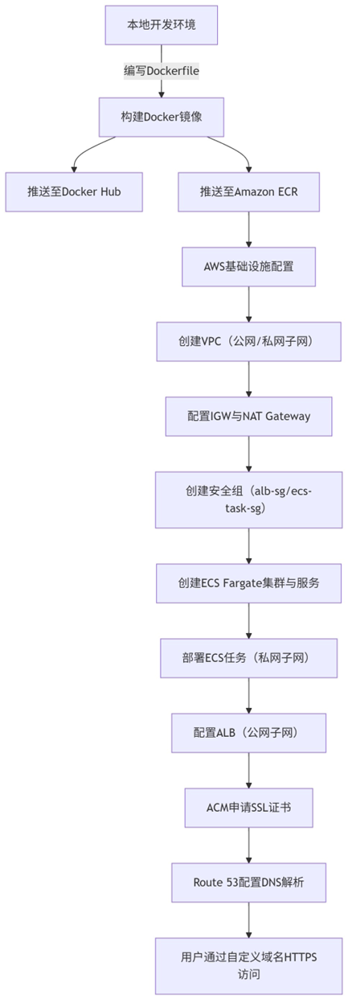

# Music Rating App Project

## Project Timeline & Attribution

- **Semester 1 (CITS3403):** Core music rating web app (Flask + Spotify integration, scoring, stats, friends).
- **Semester 2 (Cloud Computing):** Dockerized deployment and AWS scaling-focused work (done after the original team project phase).
- The original team-phase README (full user guide + screenshots) is preserved in [README_CITS3403_PROJECT.md](README_CITS3403_PROJECT.md).

## About

Rankd is a music rating web app where users can rate tracks/albums/artists and generate stats comparing their ratings with their listening history.

This README focuses on running/deploying the app via Docker (and AWS). For the original team-project documentation and screenshots, see [README_CITS3403_PROJECT.md](README_CITS3403_PROJECT.md).

For the full Cloud Computing / AWS deployment write-up, see [docs/AWS_Cloud_Deployment_Report.md](docs/AWS_Cloud_Deployment_Report.md).

## Prerequisites

- Spotify API access (typically requires a Spotify Premium account).
- A Spotify Developer app configured with a redirect URI that matches your deployment.

## Quick Start (Docker)

This project can be run locally or deployed in a consistent, scalable way using Docker (e.g. on AWS).

1. Create your environment file (or export env vars)

   - Copy `.env.example` to `.env` and fill in values.
   - At minimum you must provide:
     - `SPOTIFY_CLIENT_ID`
     - `SPOTIFY_REDIRECT_URI`
     - `SECRET_KEY`

2. Build the image

   ```
   docker build -t rankd .
   ```

3. Run the container

   ```
   docker run --rm -p 5000:5000 --env-file .env rankd
   ```

4. Open the app

   - http://127.0.0.1:5000

## Configuration

Set these environment variables (via `.env` for local Docker, or in your AWS environment):

- `SECRET_KEY` (required): Flask session signing key.
- `SPOTIFY_CLIENT_ID` (required): Spotify developer app client ID.
- `SPOTIFY_REDIRECT_URI` (required): Must match the redirect URI configured in the Spotify developer dashboard (typically ends with `/auth`).
- `DATABASE_URL` (optional): SQLAlchemy DB URL (e.g. Postgres on AWS RDS). If omitted, the app uses its default DB configuration.

### Deployment Notes (AWS)

- Configure the same environment variables in your deployment target (ECS/EC2/Elastic Beanstalk).
- If using Postgres (e.g. AWS RDS), set `DATABASE_URL` to a SQLAlchemy-compatible URL.
  - Some platforms provide `postgres://...` which is automatically normalized to `postgresql://...`.

## AWS Deployment (Historical)

We deployed this app to AWS behind a custom domain with HTTPS, so it could be accessed globally via a standard website link.

- Previously deployed at: https://www.rankdmusic.online

> The original domain/hosted resources have since expired or been torn down, so the public URL may no longer be reachable today.

### High-level Architecture

- **ECR** stores the Docker image.
- **ECS Fargate** runs multiple container tasks (horizontal scaling).
- **ALB (Application Load Balancer)** terminates TLS (HTTPS) and forwards requests to ECS tasks on port `5000`.
- **VPC networking** uses public subnets for ALB and private subnets for ECS tasks; **NAT Gateway** enables outbound internet access from private subnets.
- **RDS Postgres** provides a shared database for multi-task deployments (avoids container-local SQLite “data islands”).
- **ACM** provides the SSL/TLS certificate.
- **Route 53** provides DNS records pointing the custom domain to the ALB.
- **CloudWatch Logs** support debugging and operational monitoring.

### Process Overview (What We Did)

1. **Containerize the app** using Docker (Gunicorn on port `5000`).
2. **Build and push image** to **Amazon ECR**.
3. **Provision networking**: VPC, public/private subnets (multi-AZ), Internet Gateway, NAT Gateway, and route tables.
4. **Configure security groups**:
   - ALB SG allows inbound `80/443` from the internet.
   - ECS task SG allows inbound `5000` from the ALB SG.
5. **Provision database**: RDS PostgreSQL, and set `DATABASE_URL` for the service.
6. **Deploy to ECS Fargate**:
   - Task definition references ECR image and sets required environment variables.
   - ECS service runs tasks in private subnets and registers them to an ALB target group.
7. **Configure ALB**:
   - Listener `80` redirects to `443`.
   - Listener `443` forwards to the ECS target group (port `5000`).
8. **Enable custom domain + HTTPS**:
   - Request certificate in ACM.
   - Create Route 53 records pointing the domain to the ALB.
   - Update Spotify redirect URI to `https://<your-domain>/auth`.

For full details and troubleshooting notes (503/504, SG timeouts, DB init, etc.), see [docs/AWS_Cloud_Deployment_Report.md](docs/AWS_Cloud_Deployment_Report.md).

### Screenshots

App UI (deployed and accessible via a public URL at the time):





AWS deployment flow diagram used during the Cloud Computing phase:



## Spotify Developer App Setup (Summary)

- Create a Spotify app in the developer dashboard.
- Add a redirect URI that matches where your app is reachable, ending with `/auth`.
  - Local Docker example: `http://127.0.0.1:5000/auth`
- Export `SPOTIFY_CLIENT_ID` and `SPOTIFY_REDIRECT_URI` in your environment.
- If your Spotify app is in “Development Mode”, add testers under User Management.

For the full step-by-step guide with screenshots, see [README_CITS3403_PROJECT.md](README_CITS3403_PROJECT.md).

## Running Without Docker (Local)

If you prefer to run locally without Docker:

```
pip install -r requirements.txt
python project.py
```

Make sure the required environment variables are set (see Configuration above).

## Tests (Optional)

```
python -m unittest tests.unittest
python -m unittest tests.systemtest
```

System tests require ChromeDriver and will use port 5000.
